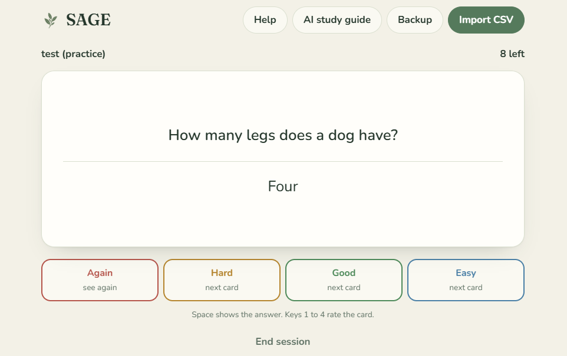
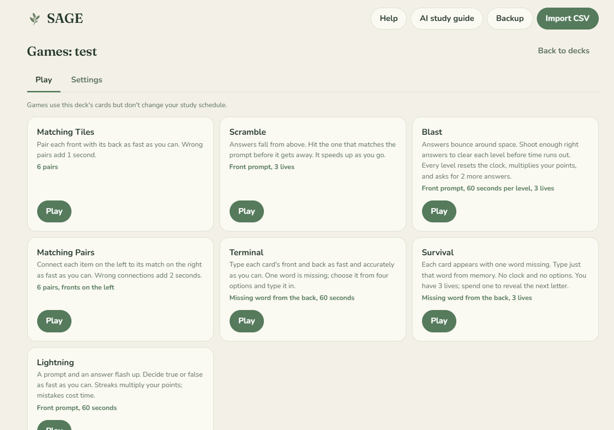
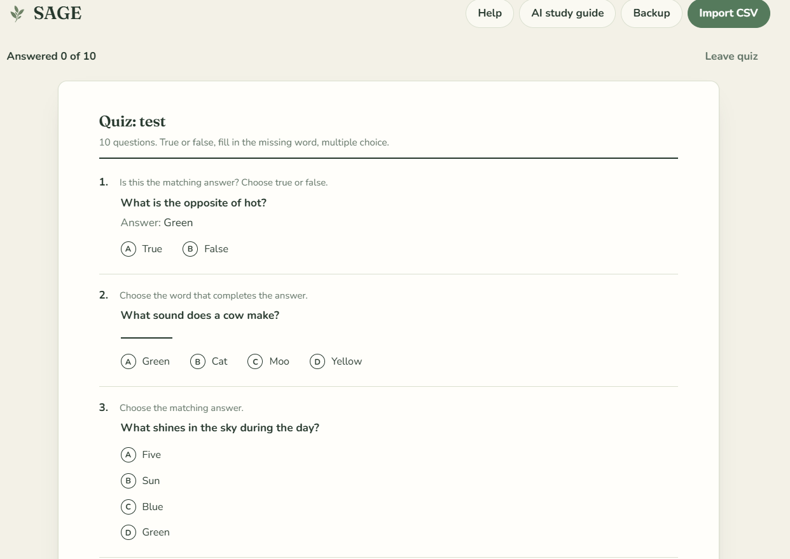
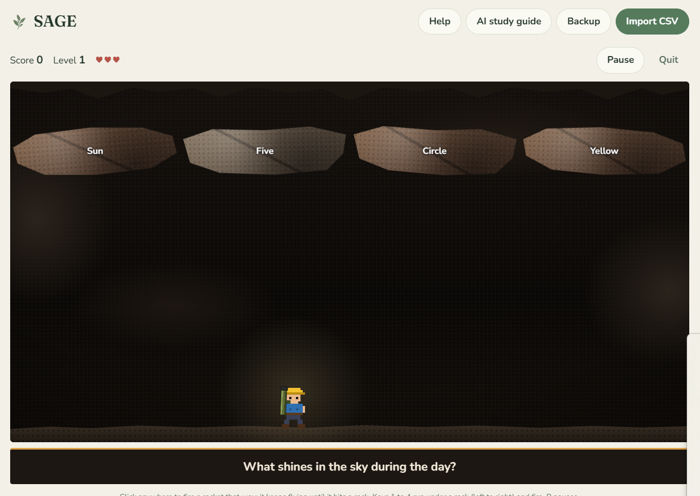

# SAGE

**Study with Adaptive Gaming Environments**

A free, private study app in a single file: spaced-repetition flash cards, a printable-style quiz, seven study games, and an optional AI study guide, all built from your own notes. No account, no ads, no install.

| | |
| --- | --- |
|  |  |
|  |  |

**[Use SAGE online](https://tobiward.github.io/SAGE/sage.html) · [Download sage.html](https://github.com/tobiward/SAGE/releases/latest/download/sage.html)**

Everything in this README also appears in the app under **Help**.

## Getting started

1. Download `sage.html`.
2. Keep it on your desktop (or a shortcut to it; see [Desktop icon](#give-sage-its-own-desktop-icon)).
3. Double-click it whenever you want to study, just like opening an app. It opens in your web browser and works offline.
4. Click **Import CSV** and choose a file, or paste text. Pick which column is the front and which is the back.
5. Press **Flash cards** on your deck to study. Flip a card, then rate how well you knew it.
6. Try the **Quiz** to test yourself or **Games** for practice. Use **Options → Edit cards** to fix or add cards.

## Making cards

A **CSV** is plain text where each line is one card: the front, a comma, then the back.

```csv
Front,Back
Mitochondria,Powerhouse of the cell
Osmosis,Water moving across a membrane
```

**No CSV? Let a free AI chat make one.**

1. Open a free AI chat such as Claude, Gemini, or ChatGPT.
2. Type **"Make this into a CSV file"**, then paste your notes, or attach photos, screenshots, or a PDF of them.
3. Copy the reply, then in SAGE choose **Import CSV**, open **Or paste text instead**, paste, and press **Use pasted text**.

**From a spreadsheet:** put fronts in column A and backs in column B, then save or download as CSV (in Excel, choose "CSV UTF-8"). You can also copy the two columns and paste them straight into the paste box.

**More than two columns?** SAGE keeps every column. Later, in **Options → Edit cards**, you can choose which columns appear on each side, including several on one side.

Prefer to skip hopping between platforms? The built-in [AI study guide](#ai-study-guide-and-free-api-keys) does all of this inside SAGE once you add an API key.

### What can I paste?

One card per line or table row, with the **front first** and the **back second**. Any of these work, even when they sit inside a longer AI reply; extra sentences around the cards are ignored.

| Format | Example |
| --- | --- |
| Comma separated | `Mitochondria,Powerhouse of the cell` |
| Quoted (use quotes when the text has commas) | `"Mitochondria", "Powerhouse, of the cell"` |
| Tab separated (copying two columns from Excel or Google Sheets) | `Mitochondria⇥Powerhouse of the cell` |
| Tables from AI chats | `\| Mitochondria \| Powerhouse of the cell \|` |
| Lists, one per line, with or without bullets or numbers | `Mitochondria: Powerhouse of the cell` or `Mitochondria - Powerhouse of the cell` |

A header row like `Front,Back` or `Term,Definition` is optional; SAGE spots it and lets you confirm. Semicolons work in place of commas too. Files can be `.csv`, `.tsv`, or `.txt`.

## Flash cards

- Each deck shows **New** (never studied), **Learning** (seen recently, coming back soon), and **Due** (ready for review today).
- After flipping a card, rate it: **Again** if you forgot, **Hard**, **Good**, or **Easy**. Each button shows when you'll see the card next.
- Cards you know well come back less and less often. That's spaced repetition, and it's why a few minutes a day beats cramming. Scheduling uses FSRS-5, an open-source spaced repetition algorithm.
- Set new cards per day, cards per session, and target recall in **Options**. A new study day starts at 4 AM.
- Done for the day? Press **Flash cards** again for **Study more**: extra new cards, reviewing early, or free practice.

Keyboard: **Space** flips the card, **1** to **4** rate it.

## Quiz, games, and the deck editor

**Quiz:** a one-page test answered with the mouse: multiple choice, true or false, and fill in the missing word. Choose how many questions, which side is the answer, and whether answers are marked as you go or when you submit. Optionally, missed questions mark those cards as Hard in flash cards so they come back right away.

**Games** never change your study schedule. Each has its own options on the Settings tab, and most pause with **P**.

| Game | How it plays |
| --- | --- |
| **Matching Tiles** | Pair fronts with backs against the clock. |
| **Matching Pairs** | Wire each item on the left to its match on the right. |
| **Scramble** | Shoot the falling rock with the right answer. |
| **Blast** | Shoot the right planet and clear each level before time runs out. |
| **Terminal** | Type each card, choosing the missing word from four options. Every word you type adds a second to the clock. |
| **Survival** | Type just the missing word from memory, with 3 lives. Tab or the hint button reveals a letter for a life. |
| **Lightning** | Decide true or false as fast as you can. Right answers add 5 seconds (3 after five minutes), wrong ones take 5 away. |

**Deck editor** (**Options → Edit cards**): add, edit, delete (with undo), search, and reorder cards. New cards are studied in the order shown.

## AI study guide and free API keys

The **AI study guide** turns notes, photos, PDFs, or text files into flash cards plus study tips, and can use your study stats to point out weak spots. It needs an **API key**: a password that lets SAGE talk to an AI for you.

**Recommended free option: Google Gemini.** It has a free tier, usually needs no credit card, and reads photos and PDFs.

1. Go to [Google AI Studio](https://aistudio.google.com/app/apikey) and sign in with a Google account.
2. Click **Create API key**, then copy the key (it starts with `AIza`).
3. In SAGE, open **AI study guide**, choose **Google Gemini**, and paste the key. The model box fills in `gemini-3.5-flash-lite`: stable, fast, reads images and PDFs, and has a much bigger free daily allowance (about 500 requests a day, versus about 20 for the full Flash models). You can type another model name into the box anytime.

- **Choose a model that can read images and files.** Text-only models can't use photos or PDFs.
- **Free means rate-limited.** If you see "too many requests," wait a minute. Free limits change from time to time; AI Studio shows the current ones.
- **"Busy" or "overloaded" errors** come from Google's servers, not your key. SAGE automatically retries and, if needed, switches to a backup Gemini model, telling you which one answered.
- **Privacy:** Google says free-tier requests may be used to improve its products, so avoid sending anything private.
- **Other options:** Anthropic (Claude) and OpenAI, or any service with an OpenAI-style API, work too. They're pay-as-you-go; a study guide typically costs a few cents.
- **The instructions are yours to edit.** Change the **Instructions for the AI** box to get more cards, simpler wording, or another language. **Reset to default** brings back the original.

## Saving, backups, and updating

- Everything saves automatically in your browser on your computer. There's no account.
- **Autosave to a file (Chrome and Edge, recommended):** open **Backup** and press **Choose a save file** once. SAGE then keeps that file up to date every time you study, so your decks are safe even if browser data is cleared. On a new computer, choose **Use an existing save file** to pick up where you left off. After a browser restart, you may need to press **Reconnect** once.
- **Backup reminder:** if nothing has been saved outside the browser for a week, SAGE shows a note with a one-click backup. **Remind me later** hides it for three days.
- **Storage protection:** SAGE asks your browser not to clear its data on its own when space runs low. Some browsers ask you to allow this.
- Clearing your browser's history or site data deletes your decks. Opening SAGE in a different browser starts empty.
- Use **Backup → Export backup** every so often. To move to another computer or browser, export there and choose **Restore from backup** here.
- Leave `sage.html` where it is. In some browsers, moving or renaming it can hide your saved decks (restoring a backup brings them back).
- The website version and a downloaded copy keep separate decks. Pick one, or use a backup to move between them.

**Updating SAGE:** your decks live in the browser, not in the file, so updating doesn't erase them.

1. Export a backup, just in case.
2. Download the new `sage.html` and put it exactly where the old one was, with the same name, replacing it.
3. Open it. Your decks are still there. The version number is at the bottom of the page.

Using the website version? Updates arrive automatically; just refresh.

## Give SAGE its own desktop icon

A plain HTML file shows your browser's logo. Download `sage.ico` (Windows) or `sage-icon.png` (Mac) from the latest release and keep it next to `sage.html`.

**Windows**

1. Keep `sage.html` and `sage.ico` together in a folder, such as Documents\SAGE.
2. Right-click `sage.html`, choose **Show more options → Send to → Desktop (create shortcut)**.
3. Right-click the new shortcut, choose **Properties → Change Icon → Browse**, pick `sage.ico`, and press OK. Rename the shortcut to SAGE.

**Mac**

1. Open `sage-icon.png` in Preview, then choose **Edit → Select All** and **Edit → Copy**.
2. Click `sage.html` in Finder and choose **File → Get Info**.
3. Click the small icon at the top left of the Info window and press **Command+V**.

**Website version:** in Chrome or Edge, open the browser menu and choose **Install** or **Create shortcut** (tick "Open as window") to get a SAGE icon on your desktop.

## Privacy and safety

- No account, no ads, no tracking. Your cards never leave your browser except when you use the AI study guide.
- SAGE only contacts the internet for its fonts (Google Fonts; offline it uses your system fonts), and for the AI provider you set up, only when you press **Create study guide**. Your material, and your deck stats if you chose to include them, go directly to that provider under its privacy terms.
- SAGE only runs its own code. A content security policy blocks outside scripts, card text is always shown as plain text, and backup files are checked and cleaned before they're restored.
- Your API key stays in your browser and is never included in backups. Use **Forget key** on shared computers, and set a spending limit with your AI provider if it's a paid one.

## Supporting SAGE

SAGE is free. If it helps you, the **Donate** link under the SAGE logo shows crypto addresses and QR codes for tips. Don't want to see it? Hide it on the donate page or in **Help**, and bring it back anytime.

**Always check that an address in the app matches one listed here before sending.** Copies of SAGE shared elsewhere could have different addresses.

- **Bitcoin (BTC):** `bc1q9tyjr2xz9jye3ehu2v3kp9hfm2yl0rgm4hucyt`
- **Ethereum (ETH):** `0x34697611D36C23cAa5f849b0146BA8A01384C761`
- **Solana (SOL):** `AYr2VmvZ6PUJrjgoi6RwD8C4uzWMhJs8ZNdhzkC2cNuC`

## Troubleshooting

<details><summary>My decks disappeared</summary>

They're tied to the browser and the file's location. Open SAGE in the same browser you used before, from the same folder. If your browser data was cleared, restore your latest backup.
</details>

<details><summary>Pasted text says it couldn't find any cards</summary>

Each card needs a front and a back on one line or table row. See [What can I paste?](#what-can-i-paste) for formats that work. If you pasted an AI reply, make sure you copied all of it.
</details>

<details><summary>A file import shows only one column</summary>

Each line needs a front and a back separated by a comma, tab, or semicolon. Try opening the file and pasting its text into the paste box instead.
</details>

<details><summary>Accented letters look wrong (like é instead of é)</summary>

Save the file as "CSV UTF-8" in Excel, or download it as CSV from Google Sheets, then import again.
</details>

<details><summary>A game says it needs more cards</summary>

Some games need at least 3 or 4 cards whose fronts and backs are all different. Add cards, or remove duplicates in **Options → Edit cards**.
</details>

<details><summary>Long cards look crowded in games</summary>

Games work best with fronts under about 60 characters and backs under about 150. Flash cards and the quiz handle longer text fine. See [Recommended limits](#recommended-limits).
</details>

<details><summary>The AI study guide shows an error</summary>

- **Key rejected:** copy the key again and check the provider matches the key (Gemini keys start with `AIza`).
- **Model name not found:** models get renamed or retired. Check your provider's model list and type a current name in the Model box.
- **Busy or overloaded:** the provider's servers are swamped. SAGE retries and switches Gemini models on its own; if it still fails, try again in a few minutes.
- **Too many requests or out of credit:** wait a minute on the free tier, or check your provider account.
- **Couldn't reach the provider:** check your internet connection.
- **Google says the key isn't allowed for this API:** open the key in Google AI Studio and make sure it's limited to the Gemini (Generative Language) API.
- **Photos or PDFs ignored:** choose a model that can read images and files.
</details>

<details><summary>The text looks plain or different when I'm offline</summary>

SAGE's fonts load from the internet. Offline, it uses your computer's fonts, and everything still works.
</details>

## Recommended limits

SAGE was tested with very long cards and large decks. It won't break past these numbers, but this is where things work best.

| What | Recommended | Notes |
| --- | --- | --- |
| Front of a card | Up to about **60 characters** | Flash cards, the quiz, and the typing games handle much longer text. |
| Back of a card | Up to about **150 characters** | Up to about 500 is fine for flash cards and the quiz. |
| Answers in Blast and Scramble | Under about **40 characters** | These are printed on planets and rocks, so shorter reads best. Longer text shrinks to fit. |
| Cards per deck | Up to about **5,000** | 5,000 cards imported, searched, and edited instantly in testing. |
| All decks together | About **15,000 to 20,000** short cards | Browsers give each site roughly 5 MB of storage. A typical card uses about 220 bytes. |
| CSV file size | Under about **2 MB** | Split bigger files into several decks. |

## Browser support

Current versions of Chrome, Edge, Firefox, and Safari, on desktop and mobile. The typing games need a physical keyboard to be fun.

## For developers

SAGE is **developed as many small files and shipped as one.** Users only ever see `sage.html`; the source is split up so it's easy to read and change.

```
src/
  app.html            page markup, with {{FAVICON}}, {{CSS}} and {{JS}} placeholders
  css/01-*.css ...    styles, one file per area, joined in filename order
  js/01-*.js ...      scripts, one file per feature (scheduler, storage, each game, quiz, AI...), joined in order
  assets/favicon.png  the leaf icon, embedded at build time
build.py              stitches src/ into sage.html (Python 3.8+, no packages)
tests/run_tests.py    end-to-end tests in a real headless browser
sage.html             the built app (committed, because GitHub Pages and the release serve it)
index.html            forwards the Pages address to sage.html
```

**Make a change:** edit files in `src/`, then run `python build.py` and commit both your change and the rebuilt `sage.html`. Never edit `sage.html` directly; the next build overwrites it.

**Run the tests:**

```bash
pip install playwright && playwright install chromium
python build.py && python tests/run_tests.py
```

The tests open SAGE like a user would and cover every screen, scheduling, pasting in many formats, fair quiz decoys, hostile backup files, damaged saves, the backup reminder, autosave to a file, the quiz, the deck editor, the typing games and Lightning's timing, long answers on a phone-sized screen, and the AI study guide, including retries and model fallback when the provider is busy (all with a simulated provider). Installing `opencv-python-headless` also checks that the donate QR codes scan. GitHub runs the same tests on every push (see `.github/workflows/test.yml`).

**Customizing.** The settings at the top of `src/js/01-config.js` set the app name, version, GitHub link, and donate addresses. Leave a value empty to hide it.

**Releasing an update.**
1. Bump `APP_VERSION` in `src/js/01-config.js` and add an entry to `CHANGELOG.md`.
2. Run `python build.py && python tests/run_tests.py`, then commit and push. The website updates by itself.
3. Publish a new GitHub Release (not a pre-release) with `sage.html`, `sage.ico`, and `sage-icon.png` attached.

Saved data uses a versioned format and every load passes through a cleaning step, so new versions can upgrade old saves.

**Hosting your own copy.** Enable GitHub Pages in the repository settings (main branch, root folder). Every project under the same `your-name.github.io` address shares browser storage with the others, including saved API keys, so only host projects you trust there, or give SAGE its own custom domain.

**Contributing.** Issues and pull requests are welcome. Please include the rebuilt `sage.html` and make sure the tests pass.

## How it was made

SAGE was designed and directed by Tobi Ward and built with the help of Claude, an AI assistant from Anthropic. Every feature, game, and design choice went through hands-on testing and revision. If you find a bug, please open an issue.

## License

[MIT](LICENSE) © 2026 Tobi Ward
